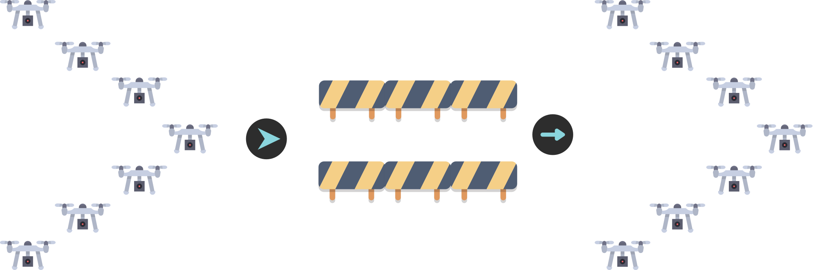
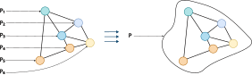
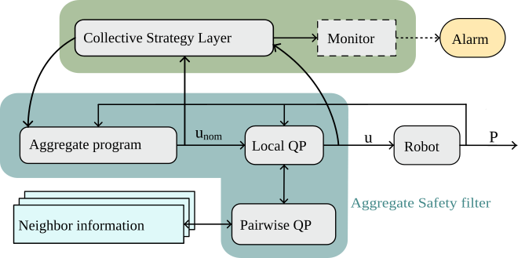
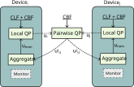
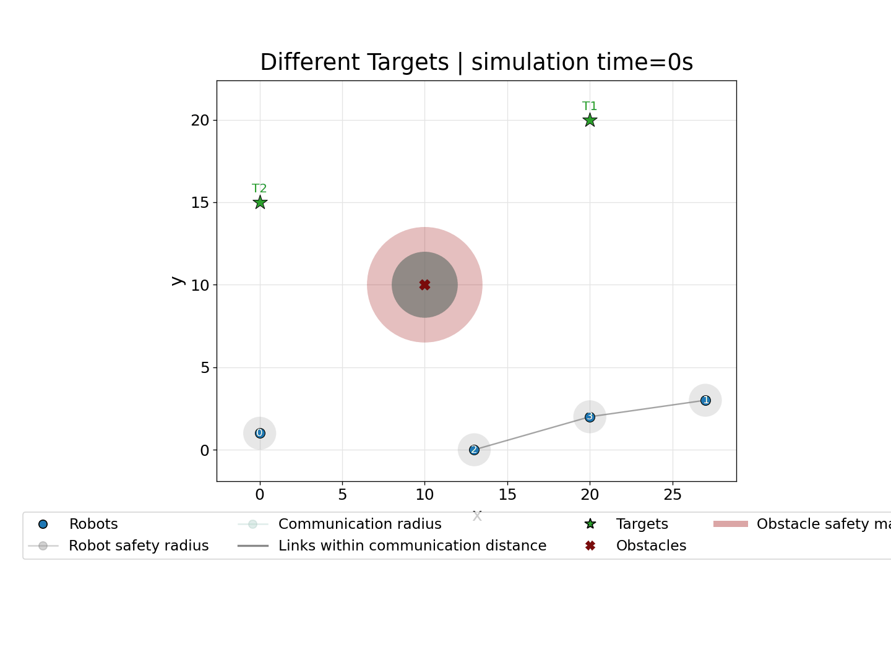
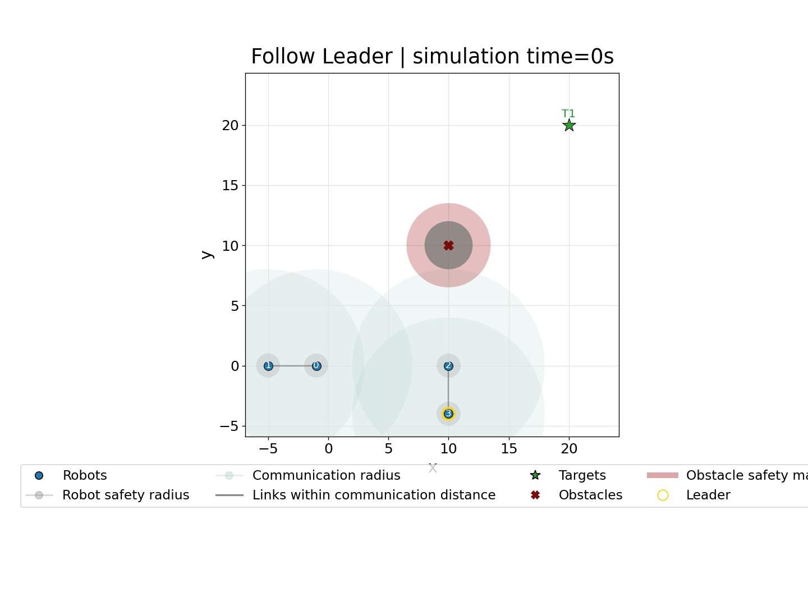
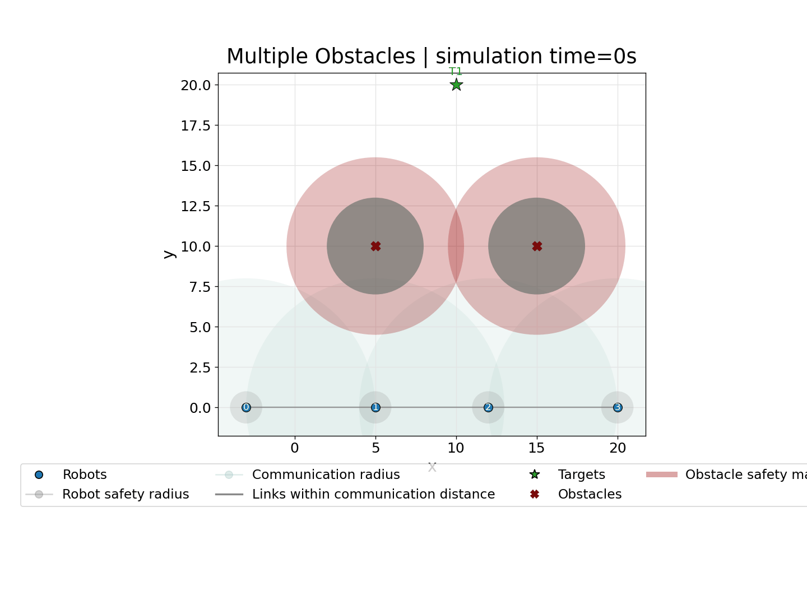

+++
title = "Toward Safe Aggregate Computing"
description = "A distributed control-theoretic safety filter for robot swarms."
outputs = ["Reveal"]
[params.reveal_hugo.katex]
enable = true
+++

# Toward **Safe Aggregate Computing**:
# A Distributed Control-Theoretic Safety Filter for Robot Swarms

[**Angela Cortecchia**](mailto:angela.cortecchia@unibo.it)<small>1</small>,
[Alessandro Papadopoulos](mailto:alessandro.papadopoulos@mdu.se)<small>2</small>,
[Danilo Pianini](mailto:danilo.pianini@unibo.it)<small>1</small>

{}

<small>*1</small> Department of Computer Science and Engineering (DISI) 
Alma Mater Studiorum -- University of Bologna - Cesena, Italy 
 
<small>*2</small>Department of Computer Science and Engineering 
Mälardalen University, Västerås, Sweden

{}

  
  

---

# Programming adaptive robot swarms safely
### Collective behavior and safety are both required

{}
{}

{}
{}

In applications such as search and rescue or environmental monitoring, groups of robots must:

- coordinate toward a common objective;
- adapt to changing conditions;
- remain safe while doing so.

A collective strategy may correctly describe <strong>where the swarm should go</strong>, while still producing unsafe motion on the way.

{}
{}

We need both an expressive way to specify collective behavior and a mechanism that enforces safety during execution.

---

# Aggregate Computing
### Programming the collective, not each robot

  

    
  

  

    
Aggregate Computing raises the programming abstraction from individual devices to <strong>collective behavior</strong>.

    
Developers compose <strong>computational fields</strong>: distributed values that evolve through local interaction across the network.

  

  spreading information
  aggregating values
  electing leaders
  forming collective patterns

One global program is executed locally by all robots through repeated neighbor-to-neighbor interaction.

---

# How AC executes
### Sense → compute → communicate / act

{}
{}

  
Each robot repeatedly:

  

    01
    
<strong>Senses</strong> local inputs and the latest messages from neighbors.

  

  

    02
    
<strong>Computes</strong> the aggregate program using local state and neighbor information.

  

  

    03
    
<strong>Communicates / acts</strong> by sharing the updated state and applying the local output.

  

{}
{}

### Round-based model

  

    
<strong>Each round consists of three repeated phases:</strong>

    <ol>
      <li class="fragment" data-fragment-index="1">
        <strong class="local-round-sense-text">Sense</strong> collect sensor inputs and incoming neighbor messages.
      </li>
      <li class="fragment" data-fragment-index="2">
        <strong class="local-round-compute-text">Compute</strong> evaluate the aggregate program using local state and neighbor information.
      </li>
      <li class="fragment" data-fragment-index="3">
        <strong class="local-round-interact-text">Communicate / Act</strong> share the updated state and apply the local output.
      </li>
    </ol>
    
The model does not require global lock-step.

  



{}
{}

Global self-organizing behavior emerges from repeated local interaction.

---

# The limitation: self-stabilization is eventual

AC provides reusable coordination patterns with self-stabilizing behavior.

Under stable inputs and network topology, the system can recover from transient changes and **eventually** converge to a stable collective state.

But during that transient phase — or while the environment keeps changing — the aggregate program may continue adapting without guaranteeing that every physical constraint is respected.

  obstacle collisions
  inter-robot collisions
  broken communication links

For robot swarms, eventual convergence is not enough: safety must also hold before convergence.

---

# The missing layer: safe actuation

{}
{}

### Collective level

The aggregate program computes the intended motion:

\[
u_{nom}
\]

It says where the robot would like to go.

{}
{}

### Control level

A safety filter checks whether that command is admissible.

It outputs the command actually applied:

\[
u
\]

{}
{}

The idea is not to replace AC, but to filter its commands before actuation.

---

# Two control intuitions

{}
{}

### CLF: progress

A Control Lyapunov Function measures distance from a goal.

\[
V = 0 \quad \text{at the target}
\]

The controller should make \(V\) decrease.

{}
{}

### CBF: safety

A Control Barrier Function defines a safe set.

\[
h \ge 0 \quad \text{means safe}
\]

The controller should prevent \(h\) from becoming negative.

{}
{}

CLFs encode what should happen; CBFs encode what must not happen.

---

# The safety filter

\[
\min_{u,\,\delta \ge 0}\; \|u-u_{nom}\|^2 + \rho\delta^2
\]
\[
\begin{aligned}
\dot V &\le -cV + \delta && \text{progress: soft CLF}\\
\dot h_j &\ge -\gamma_j h_j && \text{safety: hard CBFs}
\end{aligned}
\]

Stay as close as possible to the aggregate command, but never violate active hard safety constraints.

---

# Proposed architecture

  <b>1.</b> AC computes <em>unom</em>
  <b>2.</b> CLF/CBF filter computes <em>u</em>
  <b>3.</b> Robot acts and feeds back its state

Collective strategy and physical safety are kept modular.

---

# Distributed safety constraints

{}
{}

### Local constraints

- target convergence;
- obstacle clearance;
- speed limits.

{}
{}

### Pairwise constraints

- inter-robot collision avoidance;
- selected communication-link preservation.

{}
{}

Pairwise constraints expose the distributed structure of the problem.

---

# What is enforced?

  
<b>Reach the target</b>CLF on squared target distance

  
<b>Avoid obstacles</b>CBF outside obstacle clearance

  
<b>Avoid collisions</b>CBF above minimum robot separation

  
<b>Preserve connectivity</b>CBF below selected communication range

  
<b>Respect speed limits</b>Bound on the control input

The active constraints depend on the collective task being executed.

---

# Proof of concept

  
<strong>4</strong>robots in 2D

  
<strong>2 m</strong>minimum separation

  
<strong>10 m</strong>communication range

  
<strong>2 m/s</strong>maximum speed

<b>Collektive</b> specifies the aggregate behavior &nbsp;→&nbsp; <b>Alchemist</b> simulates the swarm &nbsp;→&nbsp; <b>Gurobi</b> solves the QPs

This is a proof of concept: the goal is to validate the architecture, not yet to provide a scalability benchmark.

---

# Scenario 1: different targets

Different nominal goals, shared safety constraints: robots reach their targets while avoiding obstacles and collisions.

---

# Scenario 2: leader election and connectivity

The aggregate strategy adapts when clusters merge, while the safety filter preserves selected communication links.

---

# Scenario 3: when safety reveals a strategy limit

The filter correctly blocks unsafe motion, but a direct target policy can get trapped in a local minimum.

This motivates runtime strategy adaptation in the AC layer: switch target, waypoint, or exploration policy.

---

# Takeaways

  
<b>Aggregate Computing</b> gives a high-level language for adaptive collective behavior.

  
<b>CLF/CBF filtering</b> turns progress and safety requirements into constraints before actuation.

  
<b>Distributed optimization</b> exploits local and pairwise structure through neighbor exchanges.

Safe Aggregate Computing means keeping self-organization programmable without treating transient safety as an afterthought.

Next: scalability, communication overhead, richer swarm behaviors, and runtime strategy changes.

---

# Thank you for the attention!

Reproducible experiments here:

angelacorte/experiments-2026-acsos-ws-carol