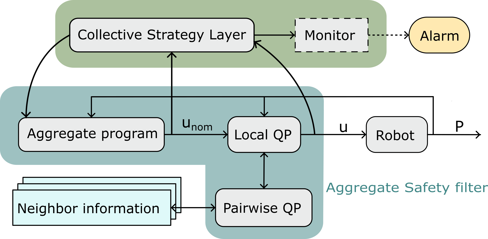
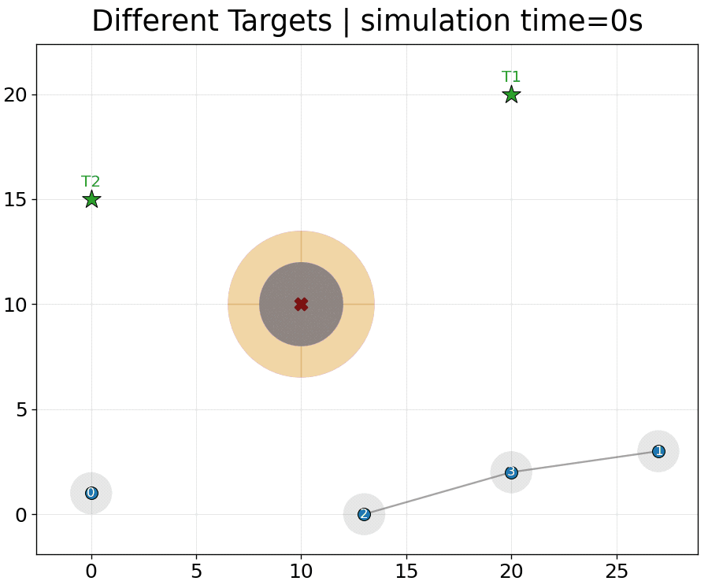
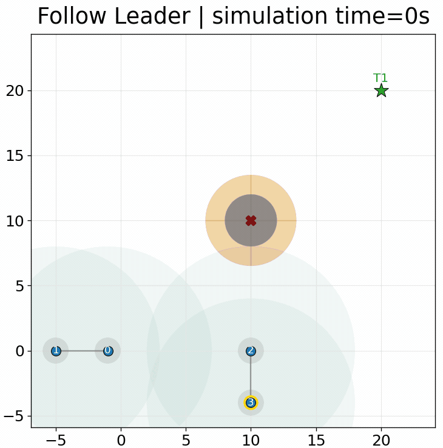
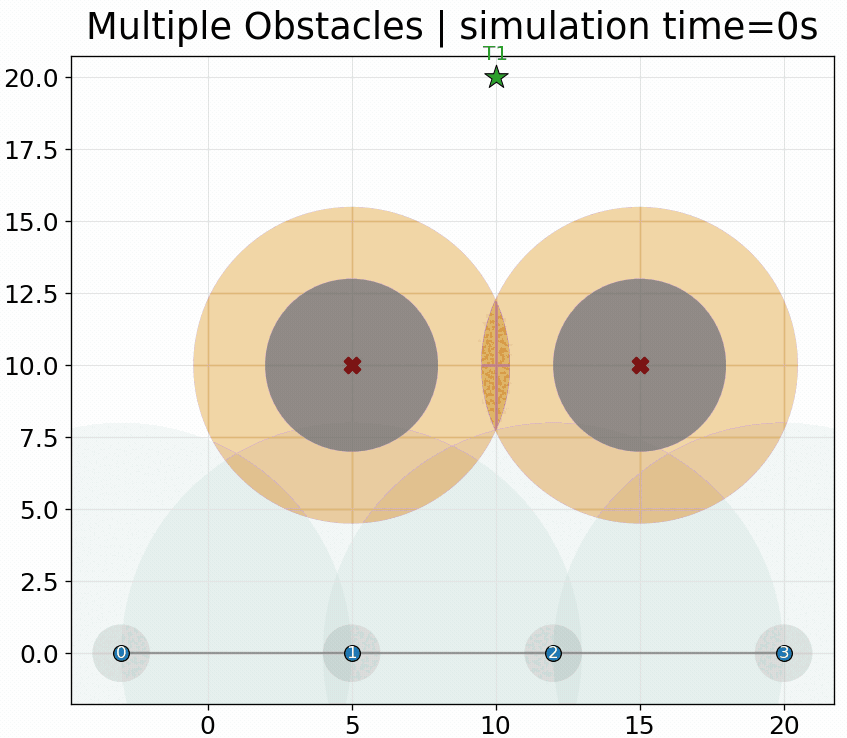

+++
title = "Toward Safe Aggregate Computing"
description = "A distributed control-theoretic safety filter for robot swarms."
outputs = ["Reveal"]
[params.reveal_hugo.katex]
enable = true
+++

# Toward **Safe Aggregate Computing**: A Distributed Control-Theoretic Safety Filter for Robot Swarms

[**Angela Cortecchia**](mailto:angela.cortecchia@unibo.it)<small>1</small>,
[Alessandro Papadopoulos](mailto:alessandro.papadopoulos@mdu.se)<small>2</small>,
[Danilo Pianini](mailto:danilo.pianini@unibo.it)<small>1</small>

{}

<small>*1</small> Department of Computer Science and Engineering (DISI) 
Alma Mater Studiorum -- University of Bologna - Cesena, Italy 
 
<small>*2</small>Department of Computer Science and Engineering 
Mälardalen University, Västerås, Sweden

{}

  
  

---

# Safe adaptation in robot swarms
### Collective strategies must respect physical constraints during execution

In search and rescue or environmental monitoring, a swarm must reach its goal &mdash; and stay safe on the way.

  

    
    
the group splits to get through: links break

  

  

    
    
what we want: around the obstacle, still connected

  

We need both an expressive way to specify collective behavior and a mechanism that enforces safety during execution.

---

# Aggregate Computing
### Programming the collective, not each robot

  

    
  

  

    
Aggregate Computing raises the programming abstraction from individual devices to <strong>collective behavior</strong>.

    
Developers compose <strong>computational fields</strong>: distributed values that evolve through local interaction across the network.

  

  spreading information
  aggregating values
  electing leaders
  forming collective patterns

One global program is executed locally by all robots through repeated neighbor-to-neighbor interaction.

---

# How AC executes
### Sense → compute → communicate / act

{}
{}

  
Each robot repeatedly:

  

    01
    
<strong>Senses</strong> local inputs and the latest messages from neighbors.

  

  

    02
    
<strong>Computes</strong> the aggregate program using local state and neighbor information.

  

  

    03
    
<strong>Communicates / acts</strong> by sharing the updated state and applying the local output.

  

{}
{}

### Round-based model



{}
{}

Global self-organizing behavior emerges from repeated local interaction.

---

# The limitation: self-stabilization is eventual
### Convergence is guaranteed, but only in the limit

{}
{}

<video
    class="field-video"
    data-autoplay
    src="./images/eventual_consistency.mp4"
    type="video/mp4"
    loop
    muted
    playsinline>
</video>

{}
{}

  

    01
    
AC building blocks are <strong>self-stabilizing</strong>: under stable inputs and topology, the swarm recovers from transient faults.

  

  

    02
    
But the guarantee is <strong>eventual</strong> &mdash; a stable state is reached after an <em>indefinite</em> number of rounds.

  

  

    03
    
Meanwhile the program keeps adapting, with <strong>nothing enforcing physical constraints</strong> at every instant.

  

{}
{}

  obstacle collisions
  inter-robot collisions
  broken communication links

For robot swarms, eventual convergence is not enough: safety must also hold before convergence.

---

# The safety layer
### The aggregate command is filtered, not replaced

Collective strategy and physical safety stay modular: AC commands are filtered, not replaced.

---

# Control functions for convergence and safety
### One score for progress, one score for danger

  

    
Control Lyapunov Functions (CLF) &mdash; what <em>should</em> happen

    

      <svg class="ctrl-sketch" viewBox="0 0 260 116" role="img" aria-label="A trajectory descending a bowl toward the target where V is zero">
        <path d="M 20 16 Q 130 150 240 16" fill="none" stroke="#1668b2" stroke-width="2.4" stroke-linecap="round"/>
        <line x1="16" y1="88" x2="244" y2="88" stroke="#1668b2" stroke-width="1.4" stroke-dasharray="5 5" opacity="0.5"/>
        <circle cx="64" cy="60" r="6.5" fill="#1668b2"/>
        <path d="M 84 72 q 20 11 44 15" fill="none" stroke="#0b1f33" stroke-width="2" stroke-linecap="round" marker-end="url(#clfArrow)"/>
        <defs>
          <marker id="clfArrow" markerWidth="7" markerHeight="7" refX="5.5" refY="3" orient="auto">
            <path d="M 0 0 L 6 3 L 0 6 z" fill="#0b1f33"/>
          </marker>
        </defs>
        <text x="130" y="104" text-anchor="middle" fill="#1668b2">V = 0 at the target</text>
      </svg>
      
<strong>V</strong> scores how far the robot still is from its goal. The controller must keep pushing that score down, toward zero.

    

  

  

    
Control Barrier Functions (CBF) &mdash; what must <em>not</em> happen

    

      <svg class="ctrl-sketch" viewBox="0 0 260 116" role="img" aria-label="A trajectory deflected along the boundary of the safe set">
        <path d="M 46 96 C 22 56 58 16 122 18 C 190 20 240 52 226 84 C 214 108 76 116 46 96 Z" fill="#d97706" fill-opacity="0.13" stroke="#d97706" stroke-width="2.4"/>
        <path d="M 74 86 C 120 90 178 84 200 66 C 214 50 186 36 154 41" fill="none" stroke="#0b1f33" stroke-width="2.2" stroke-linecap="round" marker-end="url(#cbfArrow)"/>
        <line x1="219" y1="52" x2="240" y2="34" stroke="#d97706" stroke-width="1.2" opacity="0.7"/>
        <defs>
          <marker id="cbfArrow" markerWidth="7" markerHeight="7" refX="5.5" refY="3" orient="auto">
            <path d="M 0 0 L 6 3 L 0 6 z" fill="#0b1f33"/>
          </marker>
        </defs>
        <text x="104" y="72" text-anchor="middle" fill="#d97706">h &#8805; 0</text>
        <text x="255" y="30" text-anchor="end" fill="#d97706" opacity="0.9">h = 0</text>
      </svg>
      
<strong>h</strong> scores how much safety margin is left. The controller must never let that score reach zero.

    

  

CLFs encode what should happen; CBFs encode what must not.

---

# Minimization Problem
### As close as possible to the nominal command, without entering the unsafe region

{}
{}

\[
\min_{u,\,\delta \ge 0}\; \|u-u_{nom}\|^2 + \rho\delta^2
\]

  

    \(\dot V \le -cV + \delta\)
    progress: soft CLF
  

  

    \(\dot h_j \ge -\gamma_j h_j\)
    safety: hard CBFs
  

{}
{}

<svg class="filter-sketch" viewBox="0 0 520 230" role="img" aria-label="The robot heads straight for its target, but the direct route crosses an unsafe region, so the filter bends the command around the boundary and back toward the target">
  <defs>
    <marker id="nomArrow" markerUnits="userSpaceOnUse" markerWidth="17" markerHeight="15" refX="0" refY="7.5" orient="auto"><path d="M 0 0 L 17 7.5 L 0 15 z" fill="#1668b2"/></marker>
    <marker id="appArrow" markerUnits="userSpaceOnUse" markerWidth="17" markerHeight="15" refX="0" refY="7.5" orient="auto"><path d="M 0 0 L 17 7.5 L 0 15 z" fill="#063f72"/></marker>
  </defs>
  <circle cx="260" cy="140" r="64" fill="#d97706" fill-opacity="0.16" stroke="#d97706" stroke-width="2" stroke-dasharray="6 5"/>
  <circle cx="260" cy="140" r="42" fill="#878480" fill-opacity="0.5"/>
  <circle cx="60" cy="140" r="10" fill="#1f77b4" stroke="#14496e" stroke-width="2"/>
  <polygon points="462,125 465.8,134.7 476.3,135.4 468.2,142 470.8,152.1 462,146.5 453.2,152.1 455.8,142 447.7,135.4 458.2,134.7" fill="#2ca02c"/>
  <text x="60" y="178" text-anchor="middle" fill="#14496e">robot</text>
  <text x="462" y="180" text-anchor="middle" fill="#2ca02c">target</text>
  <text x="260" y="146" text-anchor="middle" fill="#5c5854">unsafe</text>
  <g class="fragment" data-fragment-index="1">
    <line x1="76" y1="140" x2="436" y2="140" stroke="#0b1f33" stroke-opacity="0.2" stroke-width="2" stroke-dasharray="7 7"/>
    <path d="M 78 140 L 148 140" fill="none" stroke="#1668b2" stroke-width="4.5" stroke-dasharray="10 7" marker-end="url(#nomArrow)"/>
    <text x="130" y="166" text-anchor="middle" fill="#1668b2">u<tspan font-size="9" dy="3">nom</tspan></text>
  </g>
  <g class="fragment" data-fragment-index="2">
    <g stroke="#d97706" stroke-width="3.6" stroke-linecap="round"><line x1="192" y1="131" x2="209" y2="149"/><line x1="209" y1="131" x2="192" y2="149"/></g>
  </g>
  <g class="fragment" data-fragment-index="3">
    <path d="M 80 133 C 140 130 175 122 197.6 104 A 72 72 0 0 1 322.4 104 C 350 128 392 132 426 133" fill="none" stroke="#063f72" stroke-width="4.5" stroke-linecap="round" marker-end="url(#appArrow)"/>
    <text x="260" y="56" text-anchor="middle" fill="#063f72">u</text>
  </g>
</svg>

  <em>unom</em> &mdash; what the aggregate program asks for
  <em>u</em> &mdash; what the safety filter applies
  region the robot must stay out of

{}
{}

Stay as close as possible to the aggregate command, but never violate active hard safety constraints.

---

# What can be enforced?

  
<b>Reach the target</b>CLF on squared target distance

  
<b>Avoid obstacles</b>CBF outside obstacle clearance

  
<b>Avoid collisions</b>CBF above minimum robot separation

  
<b>Preserve connectivity</b>CBF below selected communication range

  
<b>Respect speed limits</b>Bound on the control input

The active constraints depend on the collective task being executed.

---

[//]: # (# Solving it in a distributed way)

[//]: # (### Alternating Direction Method of Multipliers &#40;ADMM&#41;)

[//]: # ()
[//]: # (
)

[//]: # (  
)

[//]: # (    Step 1)

[//]: # (    <strong>Split</strong>)

[//]: # (    
The global problem is decomposed into subproblems: one per robot, one per relevant pair.
)

[//]: # (  
)

[//]: # (  
&#10230;
)

[//]: # (  
)

[//]: # (    Step 2)

[//]: # (    <strong>Exchange</strong>)

[//]: # (    
Neighbors exchange the variables their shared constraints depend on.
)

[//]: # (  
)

[//]: # (  
&#10230;
)

[//]: # (  
)

[//]: # (    Step 3)

[//]: # (    <strong>Agree</strong>)

[//]: # (    
Each robot updates its own command, until neighbors agree on a common safe solution.
)

[//]: # (  
)

[//]: # (
)

[//]: # ()
[//]: # (
repeat until convergence
)

[//]: # ()
[//]: # (
The safety filter is itself an aggregate program: no global synchronization, only neighbor-to-neighbor exchange.
)

[//]: # ()
[//]: # (---)

# Distributed safety constraints

{}
{}

### Local constraints

- target convergence;
- obstacle clearance;
- speed limits.

{}
{}

### Pairwise constraints

- inter-robot collision avoidance;
- selected communication-link preservation.

{}
{}

Pairwise constraints expose the distributed structure of the problem.

---

# Proof of concept

  
<strong>4</strong>robots in 2D

  
<strong>2 m</strong>minimum separation

  
<strong>10 m</strong>communication range

  
<strong>2 m/s</strong>maximum speed

<b>Collektive</b> specifies the aggregate behavior &nbsp;→&nbsp; <b>Alchemist</b> simulates the swarm &nbsp;→&nbsp; <b>Gurobi</b> solves the QPs

This is a proof of concept: the goal is to validate the architecture, not yet to provide a scalability benchmark.

---

# Scenario 1: different targets

  Robots
  Robot safety radius
  Communication radius
  Links within communication distance
  &#9733;Targets
  &#10006;Obstacles
  Obstacle safety margin

Different nominal goals, shared safety constraints: robots reach their targets while avoiding obstacles and collisions.

---

# Scenario 2: leader election and connectivity

  Robots
  Robot safety radius
  Communication radius
  Links within communication distance
  &#9733;Targets
  &#10006;Obstacles
  Obstacle safety margin

The aggregate strategy adapts when clusters merge, while the safety filter preserves selected communication links.

---

# Scenario 3: when safety reveals a strategy limit

  Robots
  Robot safety radius
  Communication radius
  Links within communication distance
  &#9733;Targets
  &#10006;Obstacles
  Obstacle safety margin

The filter correctly blocks unsafe motion, but a direct target policy can get trapped in a local minimum.

This motivates runtime strategy adaptation in the AC layer: switch target, waypoint, or exploration policy.

---

# Conclusions and future work

  

    <h2>Takeaways</h2>
    

      01
      
<strong>Aggregate Computing</strong> specifies adaptive collective behavior at a high level.

    

    

      02
      
<strong>CLF/CBF filtering</strong> makes convergence and safety requirements explicit before actuation.

    

    

      03
      
<strong>Distributed optimization</strong> exploits local and pairwise structure through neighbor exchanges.

    

  

  

    <h2>Future work</h2>
    

      <h3>Quantitative evaluation</h3>
      
Measure convergence time, scalability, and communication overhead.

    

    

      <h3>Complex collective behaviors</h3>
      
Explore formation control, flocking, and coverage.

    

    

      <h3>Dynamic policies for target convergence</h3>
      
Handle local minima and improve adaptability in complex environments.

    

  

Safe Aggregate Computing keeps self-organization programmable while enforcing transient safety.

---

# Thank you for the attention!

Reproducible experiments here:

angelacorte/experiments-2026-acsos-ws-carol
